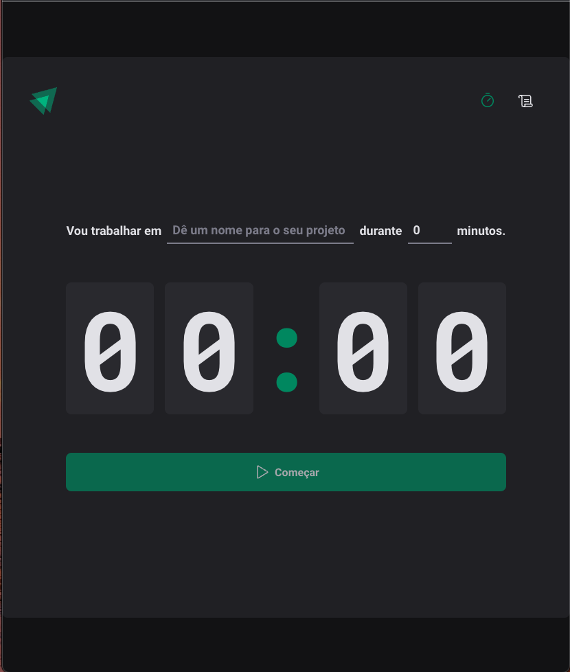

# Timer

> Manage your task time

[](https://github.com/rafaelone)
[](#)
[](https://github.com/rafaelone/Timer/stargazers)
[](https://github.com/rafaelone/Timer/network/members)

# :pushpin: Table of Contents

- [Features](#rocket-features)
- [Installation](#construction_worker-installation)
- [Getting Started](#runner-getting-started)
- [FAQ](#postbox-faq)

<br />

<p align="center"></p>

# :rocket: Features

- #### Manage your study or work time
- #### See your history

# :construction_worker: Installation

**You need to install [Node.js](https://nodejs.org/en/download/) and [Yarn](https://yarnpkg.com/) first, then in order to clone the project via HTTPS, run this command:**

```bash
git clone https://github.com/rafaelone/Timer.git
```

SSH URLs provide access to a Git repository via SSH, a secure protocol. If you have a SSH key registered in your Github account, clone the project using this command:

```bash
git clone git@github.com:rafaelone/Timer.git
```

**Install dependencies**

```bash
yarn install
```

# :runner: Getting Started

Run the following command in order to start the application in a development environment:

```bash
yarn dev
```

# :postbox: Faq

**Question:** What are the tecnologies used in this project?

**Answer:** The tecnologies used in this project are [React](https://pt-br.reactjs.org/) + [Styled Components](https://styled-components.com/) to handle scoped CSS.
